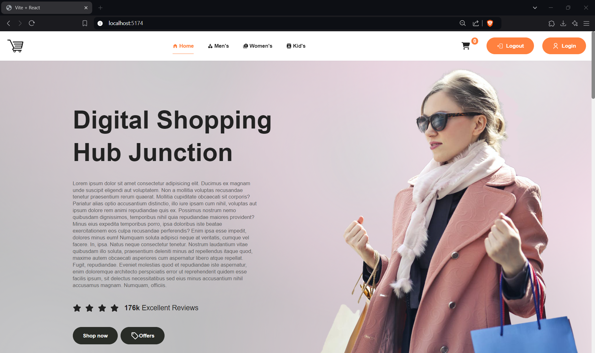
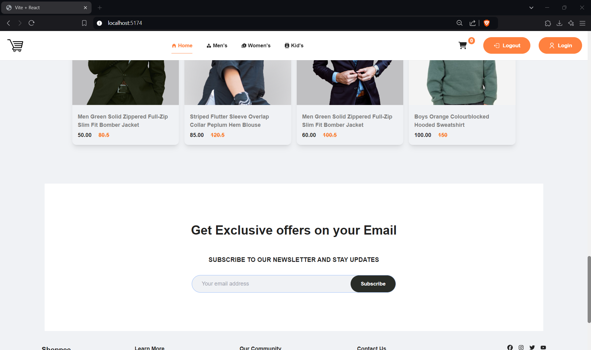

<h1>Introduction</h1>
A front end fashion webstore project created using React.

<!-- PROJECT LOGO -->
<br />
<div align="center">
  <a href="https://github.com/s7xdd/fashion-store">
    
  </a>

  <h3 align="center">Fashion Webstore</h3>

  <p align="center">
    An awesome frontend react template!
    <br />
    <a href="https://github.com/s7xdd/fashion-store"><strong>Explore the docs »</strong></a>
    <br />
    <br />
    <a href="https://fashionstore-s7xdd.netlify.app/">View Demo</a>
    ·
    <a href="https://github.com/s7xdd/fashion-store/issues/new?labels=bug&template=bug-report---.md">Report Bug</a>
    ·
    <a href=https://github.com/s7xdd/fashion-store/issues/new?labels=enhancement&template=feature-request---.md">Request Feature</a>
  </p>
</div>

## About The Project



This is a react front end ecommerce template made in Vitejs. 

### Built With

This project was built with

* [![React][React.js]][React-url]

<p align="right">(<a href="#readme-top">back to top</a>)</p>


<!-- GETTING STARTED -->
## Getting Started

This is how you can set up your project locally.
To get a local copy up and running follow these steps.

### Prerequisites

Run these commands in order
* npm
  ```sh
  cd frontend
  npm install
  npm run dev
  ```
  
<br/>
<h2>Homepage</h2>
<br/>





<br/>
<h2>Categories</h2>
<br/>


<br/>
<h2>Signup Page</h2>
<br/>


<p align="right">(<a href="#readme-top">back to top</a>)</p>

[React.js]: https://img.shields.io/badge/React-20232A?style=for-the-badge&logo=react&logoColor=61DAFB
[React-url]: https://reactjs.org/
